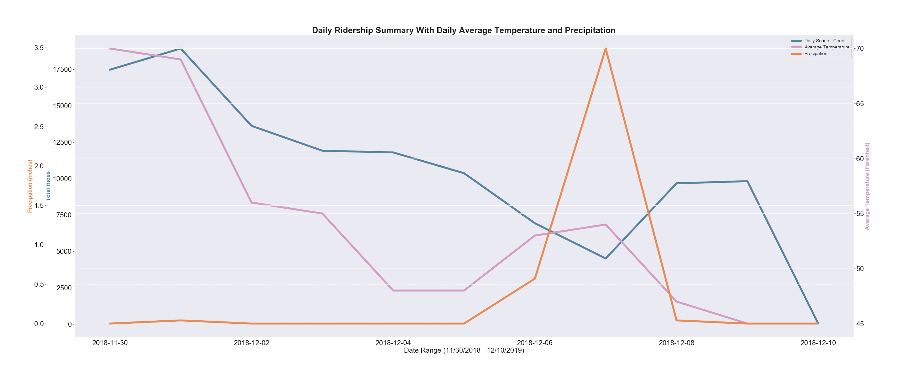

# Dockless Scooter Rides Prediction
Predict the number of scooter rides originating in a region(cell) in City of Austin

## Business Understanding
  
Micro-Mobility - Small, human or electric-powered transportation market forecasted by McKinsey report to be $200 - $300 billion dollar market by 2030 in United States alone has been on the rise. One of the main reason for this rise is attributed to the fact that traveling a short distance of 3 miles or less in many major U.S.cities is faster through e-scooters or bikes than driving a car or using a ride-sharing service. Because of the quick rise in trends and market share many cities are still in the midst of developing policies and regulations. Populus report highlighties three areas where majority of cities will focus policy and regulations on:
     
 > 1. Ensuring safety: What policies should be enacted to ensure the safety of riders and others using public space (e.g., streets and sidewalks)? What transportation planning and design modifications are possible to promote the safety of those using shared and personal micro-mobility options and others in the public right of way?
 > 2. Promoting equitable access to services: Are micro-mobility services accessible, and being utilized, by a broad segment of the population? If not, how can the city support expanding access to disadvantaged populations?
 > 3. Evaluating impacts on traffic and sustainability: How do micro-mobility services fit into the broader transportation ecosystem? Are they reducing vehicle trips? How many micro-mobility vehicles can the residents of a city effectively utilize?

City of Austin transportation IT staff agree that City of Austin is also focusing on the above policies and is in the process of updating their current policies to incorporate new findings from different interest groups, studies and citizen feedback. My goal is to present my analysis to the City of Austin transportation department so they can then present to groups working on Micro-mobility policy and regulations.
  
## Technology and Software Packages

## Directory Structure
    * src - directory for all the code
    * data - downloaded data (raw and cleaned)
    * output - results
    * documents - documents used for analysis and research
    
## Data Sources
City of Austin Open Data Portal Dockless Mobility Data   
Daily Weather from National Centers for Environmental Information (NCEI) - Austin Bergstrom Airport Weather Station

### Data Format

#### Dockless Mobility Data
City of Austin transportation department updates their dockless mobility data every hour on their Open Data Portal. For aggregration purposes they created a citywide hexagonal grid(cell) with each edge of grid of length 500ft. Each grid is a cell with a unique id.  Full set of fields and description can be found at https://data.austintexas.gov/Transportation-and-Mobility/Dockless-Vehicle-Trips/7d8e-dm7r  
  
Each trip has origin cell and destination cell id. Few of the important fields in the dataset :

     - ID - Unique trip identifier
     - Device ID - Unique ID for the device used to complete the trip
     - Vechile Type - Bicycle or Scooter
     - Trip Duration - In seconds
     - Trip Distance - In meters
     - Start Time - Datetime at which the trip started in local time
     - End Time - Datetime at which the trip ended in local time
     - Origin Cell ID 
     - Destination Cell ID
     - Start Latitude
     - Start Longitude
     - End Latitude
     - End Longitude 

#### Weather Data
Aggregrated daily weather data was downloaded from NCEI recorded at Austin Bergstorm International Airport Weather Station. Full details of the fields are available at <a href="documents/Weather_GHCND_documentation.pdf">Weather Documentation</a>  

Few of the important fields in the dataset:

     - Date - Recorded Date
     - Precipitation - Units of Measure -  inches
     - Snow - Units of Measure - inches
     - Avg_Daily_Wind_Speed - Units of Measure - mph
     - AVG_TEMPERATURE - Units of Measure - Degrees Fahrenheit
     - MAX_TEMPERATURE - Units of Measure - Degrees Fahrenheit
     - MIN_TEMPERATURE - Units of Measure - Degrees Fahrenheit

## Exploratory Data Analysis
### Data Cleaning

#### Null Values
Scooter Data had few null values and in most cases the null values were fields that were required for the modeling like Origin and Destination latitude and longitude and Origin and Destination Cells

Weather data downloaded had only one null values for temperature which was forward-filled for analysis

#### Outliers and Invalid Data
The Trip Duration ranged from -431.0 seconds to 1888695.0 seconds which definitely had lot of invalid values. These could be attributed to the failed machinery with the scooters. For the project only trips with durations from 1min to 24hrs were used.
Trip Duration 

Trip Distances ranged from -16724106.0 meters to 2147479547.0 meters but for the project only trips which had trip duration from 0.1 miles to 10 miles where used.
Trip Distance

#### InConsistent Data
From the graph below you can see the rides from April 28th - May 18th are zero. Investigating in the data I found there was a trial period and the rides and companies participating picked up after July 15th. To accommodate for a consistent trend I used data from July 15th - Jan 15th for this project. 
Daily RiderShip Summary

## Data Exploration
Further exploration of the data revealed that the total rides and hours at which the rides happen are veru different from UT Austin to Downtown Austin. The graph below confirms it. 

Trips - UT Austin vs Downtown

     
Chi-Squared test for the hourly usage patterns between UT Austin and Downtown revealed the following the results. The chi-square independence test is a procedure for testing if two categorical variables are related in some population.

Null Hypothesis H_0: 
  
Chi-Square Contigency Table - Aggregrate Rides  

|Location| Morning Rides| Morning Commute| Afternoon  | Evening Commute | Night |
|658 | 3690| 17517| 12984| 3660|
|184 | 5028| 12787| 5527| 1486|

Test Statistic - 2371.138, p-Value(4 degrees of freedom) (critical Value - 9.488 with 0.05 Significance level)  
Statistic 2371.138 > Critical Value of 9.488 so reject the null hypothesis  

Graphing the total number of rides vs Precipitation and Temperature reveals the weather has an impact on the scooter rides.   
Trips, Precipitation, Temperature

Doing a two sample T-Test on Downtown Congress and 6th Street cell data between '2018-12-06' and '2018-12-08' where precipitation was high vs between '2018-12-02' and '2018-12-04' revealed a test statistic of -2.74916. with p-value of 0.0071 with significance level of 0.05 so we reject the null hypothesis.

## Feature Engineering
Reviewing the graph below we can infer that the rides are very different in weekend and weekday
Aggregrated Weekday Weekend RiderShip Summary

The graph below also illustrates the hour of the day has an impact on the total number of rides in a hour.
Aggregrated Hourly RiderShip Summary

After Data Exploration it was evident that having weather and time of the day are important features to add to the model. The following fields were added as features:  

     - Hour - Hour at which the ride originated. (0-23hrs)
     - Hour Label - Grouping of hours 
          Morning - 12am-5:59am
          Morning Commute - 6am-9:59am
          Afternoon - 10am-2:59pm
          Evening Commute - 3pm-7:59pm
          Night - 8pm-11:59pm
     - Day of the Week - Monday(0), Tuesday(1), Wednesday(2), Thursday(3), Friday(4), Saturday(5), Sunday(6)
     - Week - Week of the year (0-51)
     - Weekday - Boolean (1 for Monday - Friday)
     - Weekend - Boolean (1 for Saturday and Sunday)
     - Month - Month of the year (January(0) - December(11))
     - Day - Day of the month (0-31)
     - Year - Year of the day (2018, 2019 etc.,)
     - Precipitation - Precipitation in inches
     - Snow - Units of Measure in inches
     - Avg_Daily_Wind_Speed - Units of Measure in mph
     - AVG_TEMPERATURE - Units of Measure in Degrees Fahrenheit
     - MAX_TEMPERATURE - Units of Measure in Degrees Fahrenheit
     - MIN_TEMPERATURE - Units of Measure in Degrees Fahrenheit

## Predictive Modeling
Traditional Time Series Models ARIMA-Moving Average, ARIMA-Auto Regressor, SARIMA, RandomForestRegressor and ADABoostRegressor models were used for doing the predictive modeling. All the models were run on the top 10 cells (regions) with most rides and with Mean Absolute Error as the error metric. I used Mean Absolute Error(MAE) as the error metric instead of Root Mean Square Error(RMSE) because RMSE gives relatively high weights to large errors which in my cases mostly were mostly related to the outliers.

**Performance of the models**
  
| Models | Mean Absolute Error (MAE) |
| --- | --- |
| ARIMA - Moving Average | 4.167 |
| ARIMA - Auto Regressor | 4.172 |
| SARIMA | 8.010 |
| **RandomForestRegressor** | **3.863** |
| AdaBoostRegressot | 4.680 |

  
RandomForestRegressor Feature importance

## Results
RandomForestRegressor model performed best of all the models with Mean Absolute Error of **3.863**

Graph slowing the actual values against prediction for a cell.

     
From the above graph we can see the model did well in most cases was off during the peak utilization. Investigating the data I found the model was not performing well during the evening commuter hours. 

## Future Work
  Integrate different event data as features into the model  
  Explore different models for Downtown Austin, UT Austin, South Congress  
  Present to City of Austin Transportation Department  
  Using hourly weather data for future modeling
   
## Acknowledgments
  City of Austin Transportation Department  
  Galvanize Instructors and Classmates of Galvanize Jan 2019 Cohort

## References
<a href = "documents/Populus_MicroMobility_2018_Jul.pdf">Populus Report</a>  
<a href="https://www.mckinsey.com/industries/automotive-and-assembly/our-insights/micromobilitys-15000-mile-checkup">McKinsey Report</a>  
https://www.microsoft.com/en-us/research/wp-content/uploads/2016/07/mobisys16bike.pdf  
https://www.researchgate.net/publication/324275044_A_deep_learning_approach_on_short-term_spatiotemporal_distribution_forecasting_of_dockless_bike-sharing_system
 

